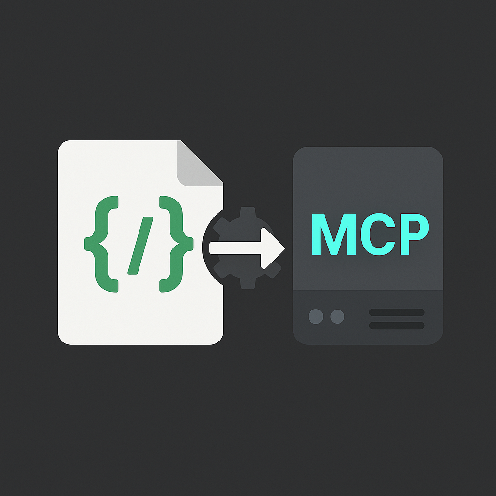

<p align="center">
  
</p>

<h1 align="center">OpenAPI → MCP Server</h1>

This Python CLI tool generates a basic Node.js/TypeScript [MCP (Model Context Protocol)](https://modelcontextprotocol.io/) server based on an OpenAPI v3 specification file (JSON or YAML), provided either as a local file path or a URL. Each operation defined in the OpenAPI specification is mapped to a corresponding MCP tool within the generated server.

The generated server acts as a proxy, receiving MCP tool calls and translating them into HTTP requests to call the actual API defined in the OpenAPI specification.

## ✨ Features

*   Parses OpenAPI v3 JSON or YAML from local files or URLs.
*   Validates the OpenAPI specification structure.
*   Maps OpenAPI operations (GET, POST, PUT, DELETE, PATCH) to MCP tools.
*   Generates MCP tool `inputSchema` (JSON Schema) based on OpenAPI parameters and request bodies (handles basic types, objects, arrays, enums, formats, simple local `$ref`s, basic cycle detection).
*   Generates a runnable Node.js/TypeScript MCP server project:
    *   Uses `@modelcontextprotocol/sdk`.
    *   Configurable transport (stdio, sse).
    *   Configurable port for SSE transport.
    *   Reads target API base URL and optional authentication header from a `.env` file.
    *   Includes basic error mapping from HTTP status codes to MCP error codes.
    *   Includes `package.json`, `tsconfig.json` (with strict settings), and example `.env` file.
    *   Provides clear setup and run instructions in a generated `README.md`.
*   Integrated linting (`ruff`) and formatting (`black`).
*   Unit and integration tests (`pytest`).
*   JSON logging.

## 🚀 Installation / Setup

**Prerequisites:**

*   **Python:** Version 3.12 or higher is required (assumed to be installed).
*   **Poetry:** This tool uses Poetry for dependency management (assumed to be installed).
*   **MCP SDK:** Version 1.5.0 (installed automatically via Poetry).
*   **Node.js:** Version 20 or higher is required for the generated server (assumed to be installed).

**Steps:**

1.  **Navigate to Project Directory:**
    Open your terminal in the directory containing this `openapi-to-mcp` code.

2.  **Install Dependencies:**
    *   **For running the tool:**
        ```bash
        poetry install --no-dev 
        ```
        This installs only the core dependencies needed to run the generator.
    *   **For development (including running tests, linting, formatting):**
        ```bash
        poetry install --with dev
        # or simply:
        poetry install 
        ```
        This installs all dependencies, including development tools like `pytest`, `black`, and `ruff`.

3.  **Activate Virtual Environment (Optional but Recommended):**
    Poetry creates a virtual environment to manage dependencies. You can activate it to run commands directly:
    ```bash
    poetry shell
    ```
    Alternatively, you can prefix commands with `poetry run`.

## 📋 Usage

The tool provides two main commands: `generate` and `test-server`.

Run commands from within the project directory (or with the virtual environment activated):

```bash
# Using poetry run
poetry run openapi-to-mcp [COMMAND] [OPTIONS]

# Or, if inside 'poetry shell'
openapi-to-mcp [COMMAND] [OPTIONS]
```

### 🛠️ `generate` Command

This command generates the MCP server code.

**Options:**

*   `--openapi-json`, `-o` (**Required**): Path or URL to the OpenAPI specification file (JSON or YAML).
*   `--output-dir`, `-d`: Output directory for the generated MCP server files. (Default: `./mcp-server`)
*   `--mcp-server-name`, `-n`: Name for the generated MCP server package. (Default: `openapi-mcp-server`)
*   `--mcp-server-version`, `-v`: Version for the generated MCP server package. (Default: `1.0.0`)
*   `--transport`, `-t`: Transport mechanism for the generated server (`stdio` or `sse`). (Default: `stdio`)
*   `--port`, `-p`: Port number to use if `--transport` is `sse`. (Default: `8080`)
*   `--help`: Show help for the `generate` command.

**Example:**

For STDIO transport, you can run the following command to generate a server for the Swagger Petstore API example:
```bash
poetry run openapi-to-mcp generate \
  --openapi-json https://petstore3.swagger.io/api/v3/openapi.json \
  --output-dir ./generated-petstore-mcp \
  --mcp-server-name petstore-mcp \
  --transport stdio
```

This command will:

1.  Fetch and validate `https://petstore3.swagger.io/api/v3/openapi.json`.
2.  Map the API operations to MCP tools.
3.  Generate the Node.js/TypeScript MCP server code in the `./generated-petstore-mcp` directory.
4.  Configure the generated server to use STDIO transport.

For SSE transport, you can run the following command to generate a server for the Swagger Petstore API example:
```bash
poetry run openapi-to-mcp generate \
  --openapi-json https://petstore3.swagger.io/api/v3/openapi.json \
  --output-dir ./generated-petstore-mcp \
  --mcp-server-name petstore-mcp \
  --transport sse \
  --port 8080
```

This command will:

1.  Fetch and validate `https://petstore3.swagger.io/api/v3/openapi.json`.
2.  Map the API operations to MCP tools.
3.  Generate the Node.js/TypeScript MCP server code in the `./generated-petstore-mcp` directory.
4.  Configure the generated server to use SSE transport on port 8080.

#### Post-Generation Steps

After running the `generate` command, follow these steps in the generated server directory (`<output-dir>` specified during generation):

1.  Navigate to the output directory:
    ```bash
    cd <output-dir> 
    ```
2.  Create/edit the `.env` file (the generator creates an `.env.example` file you can copy) and provide the required values:
    *   `TARGET_API_BASE_URL`: The base URL of the target API the generated server will interact with. The generated server validates this value on startup and will not run with placeholder URLs.
    *   `TARGET_API_AUTH_HEADER`: (Optional) A full authorization header string if required by the target API (e.g., `Authorization: Bearer your_token` or `X-API-Key: your_key`).
3.  Install dependencies:
    ```bash
    npm install
    ```
4.  Build the TypeScript code:
    ```bash
    npm run build
    ```
5.  Start the server:
    ```bash
    npm start
    ```

The generated server's own `README.md` file also contains these setup instructions. You can then test the running server using the [test-server](#test-server-command) command or the [MCP Inspector](#testing-with-mcp-inspector).

### 🧪 `test-server` Command

This command allows you to send basic JSON-RPC requests (`ListTools`, `CallTool`) to a running MCP server (generated by this tool or any other).

**Options:**

*   `--transport {sse,stdio}`: (Required) Specify the transport the server is using.
*   `--host <hostname>`: Hostname for SSE (default: `localhost`).
*   `--port <port_number>`: Port for SSE (default: `8080`).
*   `--server-cmd "<command>"`: (Required for stdio) The command to start the server (e.g., `"node ./generated-server/build/index.js"`). Ensure the path is correct relative to where you run the command.
*   `--list-tools`: Send a `ListTools` request.
*   `--tool-name <tool_name>`: Specify a tool name for a `CallTool` request.
*   `--tool-args '<json_string>'`: (Requires `--tool-name`) Provide arguments for the tool as a JSON string (e.g., `'{"petId": 123}'`).
*   `--env-source <source>`: (Optional, for stdio only) Provide environment variables to the server process. `<source>` can be:
    *   A direct JSON string: `'{"VAR1":"value1", "VAR2":"value2"}'`
    *   A path to a JSON file: `./my_env.json`
    *   A path to a `.env` file: `./generated-server/.env`
*   `--help`: Show help for the `test-server` command.

**Examples:**

*   **List tools via SSE (server running on port 8080):**
    ```bash
    poetry run openapi-to-mcp test-server --transport sse --port 8080 --list-tools 
    ```

*   **Call a tool via SSE (server running on port 8080):**
    ```bash
    poetry run openapi-to-mcp test-server --transport sse --port 8080 \
      --tool-name getPetById --tool-args '{"petId": 1}'
    ```

*   **List tools via stdio (using .env file):**
    ```bash
    # Ensure TARGET_API_BASE_URL is set in ./generated-petstore-mcp/.env
    poetry run openapi-to-mcp test-server --transport stdio \
      --server-cmd "node ./generated-petstore-mcp/build/index.js" --list-tools \
      --env-source ./generated-petstore-mcp/.env
    ```

*   **Call a tool via stdio (using JSON string for env):**
    ```bash
    poetry run openapi-to-mcp test-server --transport stdio \
      --server-cmd "node ./generated-petstore-mcp/build/index.js" \
      --tool-name addPet --tool-args '{"requestBody": {"name": "doggie", "photoUrls": []}}' \
      --env-source '{"TARGET_API_BASE_URL": "https://petstore3.swagger.io/api/v3"}'
    ```

## 🔍 Testing with MCP Inspector

Besides the `test-server` command, the [MCP Inspector](https://modelcontextprotocol.io/docs/tools/inspector) provides a graphical interface for interacting with any running MCP server.

1.  Follow the installation instructions on the MCP Inspector documentation page.
2.  Launch the Inspector.
3.  Configure a new connection:
    *   Select the appropriate transport (`stdio` or `sse`).
    *   For `stdio`, provide the full command to start your generated server (e.g., `node /path/to/your/generated-server/build/index.js`).
    *   For `sse`, provide the URL (e.g., `http://localhost:8080` or the port you specified).
4.  Connect to the server.
5.  Use the Inspector UI to view available tools (`ListTools`) and send `CallTool` requests with arguments.

This offers a more interactive way to explore and test the generated server.

## 🤝 Contributing

Interested in contributing? We welcome contributions of all kinds to `openapi-to-mcp`! Whether you’re fixing bugs, adding features, improving documentation, or sharing ideas, your input is valuable to help us improve the project.

Please refer to our [CONTRIBUTING.md](CONTRIBUTING.md) for detailed guidelines on how to get started.

## 💻 Development Workflow

Ensure you have installed dependencies using `poetry install --with dev` (or `poetry install`). Tasks are run using `poethepoet` via `poetry run poe <task_name>` or `poe <task_name>` if inside `poetry shell`.

*   **Formatting:** Apply code formatting using Ruff:
    ```bash
    poetry run poe format
    ```
*   **Linting:** Check for code style issues and apply automatic fixes using Ruff:
    ```bash
    poetry run poe lint
    ```
*   **Testing:** Run unit and integration tests using Pytest with coverage reporting:
    ```bash
    poetry run poe test
    ```
    Coverage reports (terminal and HTML) will be generated (check `htmlcov/` directory for HTML report).
*   **All Checks:** Run formatting, linting, and tests sequentially:
    ```bash
    poetry run poe check
    ```

*   **Clean Temporary Files:** Remove temporary files and directories created during the build process:
    ```bash
    poetry run poe clean
    ```

## 📄 License
This project is licensed under the Apache License 2.0. See the [LICENSE](LICENSE) file for details.

## 📚 References
* [OpenAPI Specification](https://swagger.io/specification/)
* [Model Context Protocol (MCP)](https://modelcontextprotocol.io/)
* [Python](https://www.python.org/)
* [Poetry](https://python-poetry.org/)
* [Click](https://click.palletsprojects.com/)
* [Jinja2](https://jinja.palletsprojects.com/)
* [ruff](https://beta.ruff.rs/)
* [pytest](https://docs.pytest.org/)
* [black](https://black.readthedocs.io/)
* [TypeScript](https://www.typescriptlang.org/)
* [Node.js](https://nodejs.org/)
